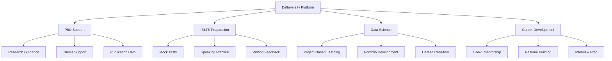

# 🎓 Deltaversity

Deltaversity is a modern educational platform designed to provide structured learning, blogs, and academic resources for students. It focuses on delivering a clean UI, organized content, and an interactive user experience.

---

## 🚀 Features

- 📚 Educational content and blog system
- 🖥️ Responsive and modern UI design
- 🔐 User-friendly navigation
- 📝 Dynamic blog section
- ⚡ Fast and optimized performance
- 🌐 Deployed web application

---

## 🛠️ Tech Stack

### Frontend:
- HTML
- CSS
- JavaScript
- React (Vite)

### Backend:
- Node.js / PHP (update if needed)

### Database:
- MongoDB / MySQL (update if needed)

### Tools & Deployment:
- Git & GitHub
- Vercel / Cloudflare (update if needed)

---

# ✨ Features

<div align="center">

### 🎯 **Mentorship-Driven Academic Excellence**

*Premium educational platform designed for ambitious learners worldwide*

</div>

---

## 🌟 Core Features

### 📚 **Comprehensive Learning Programs**

<table>
<tr>
<td width="50%">

#### 🎓 PhD Research Support
- Personalized mentorship from experienced researchers
- Research methodology and design guidance
- Thesis writing and publication support
- Literature review assistance
- Academic writing workshops

</td>
<td width="50%">

#### 🌍 IELTS Preparation
- Expert-led training sessions
- Mock tests and practice materials
- Speaking and writing feedback
- Band score improvement strategies
- Flexible scheduling options

</td>
</tr>
<tr>
<td width="50%">

#### 📊 Data Science Programs
- Hands-on project-based learning
- Industry-relevant curriculum
- Real-world case studies
- Career transition support
- Portfolio development

</td>
<td width="50%">

#### 💼 Career Development
- Professional mentorship
- Resume and LinkedIn optimization
- Interview preparation
- Career roadmap planning
- Industry networking opportunities

</td>
</tr>
</table>

---

## 🚀 Platform Capabilities

<details>
<summary><b>🎯 Mentorship-First Approach</b></summary>

- **1-on-1 Personalized Sessions**: Direct access to experienced mentors
- **Customized Learning Paths**: Tailored to individual goals and pace
- **Continuous Feedback**: Regular progress tracking and guidance
- **Flexible Scheduling**: Learn at your convenience
- **Long-term Support**: Ongoing mentorship throughout your journey

</details>

<details>
<summary><b>🌐 Global Accessibility</b></summary>

- **Remote Learning**: Access from anywhere in the world
- **Multiple Time Zones**: Sessions available across different regions
- **Digital Resources**: Comprehensive online materials
- **Community Forums**: Connect with learners globally
- **Multi-language Support**: Content available in multiple languages

</details>

<details>
<summary><b>📈 Progress Tracking</b></summary>

- **Performance Analytics**: Track your learning progress
- **Milestone Achievements**: Celebrate your successes
- **Personalized Reports**: Detailed feedback on your performance
- **Goal Setting Tools**: Set and achieve your objectives
- **Improvement Metrics**: Visualize your growth over time

</details>

<details>
<summary><b>🎓 Quality Assurance</b></summary>

- **Expert Mentors**: Industry professionals and academics
- **Curated Content**: High-quality, up-to-date materials
- **Proven Methodology**: Evidence-based teaching approaches
- **Success Stories**: Track record of student achievements
- **Continuous Improvement**: Regular curriculum updates

</details>

---

## 💡 Key Highlights

```
✅ Premium mentorship-first educational platform
✅ Accessible to learners worldwide
✅ Flexible scheduling and personalized learning
✅ Expert-led programs across multiple domains
✅ Career-focused outcomes and support
✅ Community-driven learning environment
```

---

## 🎨 User Experience

| Feature | Description |
|---------|-------------|
| 🎯 **Intuitive Interface** | Clean, modern design for seamless navigation |
| 📱 **Responsive Design** | Optimized for desktop, tablet, and mobile |
| ⚡ **Fast Performance** | Quick load times and smooth interactions |
| 🔒 **Secure Platform** | Protected data and safe learning environment |
| 💬 **Communication Tools** | Built-in messaging and video conferencing |
| 📚 **Resource Library** | Extensive collection of learning materials |

---

## 🛠️ Technical Stack

<div align="center">


</div>

---

## 📊 Program Structure



---

## 🌈 What Sets Us Apart

<table>
<tr>
<td align="center" width="33%">
<br>
<h3>🎯 Personalized</h3>
<p>Every learner gets a customized path aligned with their goals and learning style</p>
<br>
</td>
<td align="center" width="33%">
<br>
<h3>🤝 Mentorship-Driven</h3>
<p>Direct access to experts who guide you throughout your journey</p>
<br>
</td>
<td align="center" width="33%">
<br>
<h3>🌍 Global Reach</h3>
<p>Learn from anywhere with flexible scheduling and online resources</p>
<br>
</td>
</tr>
</table>

---

## 📈 Success Metrics

> **Join thousands of successful learners who have achieved their academic and career goals**

- 🎓 **PhD Candidates Supported**: 500+
- 🌟 **IELTS Band Improvement**: Average 1.5 bands
- 💼 **Career Transitions**: 1000+ successful placements
- 📊 **Student Satisfaction**: 4.8/5.0 rating
- 🌍 **Global Reach**: 50+ countries

---

## 🚀 Getting Started

<div align="center">

### Ready to elevate your learning journey?

[**🌐 Visit Deltaversity**](https://deltaversity.vercel.app) | [**📧 Contact Us**](mailto:info@deltaversity.com) | [**📚 View Programs**](#programs)

</div>

---

<div align="center">

### 💬 Need Help?

Our support team is available 24/7 to assist you with any questions

**Email**: support@deltaversity.com | **Live Chat**: Available on website

---

*Built with ❤️ for learners worldwide*

[](https://deltaversity.vercel.app)
[](LICENSE)

</div>

## ⚙️ Installation & Setup

1. Clone the repository:
```bash
git clone https://github.com/Niraj-Bhatta/deltaversity.git```

cd deltaversity

npm install

npm run dev


